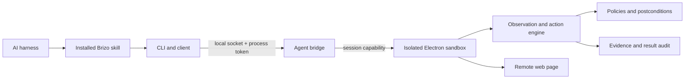

# Brizo Use architecture

Brizo separates the open Use engine from the private browser product. This repository is the source of truth for every component that an AI harness calls or a host application uses to execute an isolated Use task.

## Layers

The layers have narrow responsibilities:

- `bin` and `lib` install harness adapters, validate CLI input, launch the desktop host, and exchange one JSON request and response at a time.
- `runtime/electron/agent-bridge-core.mjs` owns local IPC, process authentication, session capabilities, and session limits. It receives a sandbox factory, so its protocol can be tested without Electron.
- `runtime/electron/agent-browser.mjs` creates an isolated `WebContentsView`, keeps Node integration off, and exposes only the task session created for the calling capability.
- `runtime/electron/browser-command-agent.mjs` turns a fresh observation into one bounded page action. The model proposes actions; deterministic code locates controls, sends input, and verifies the resulting state.
- policy and evidence modules reject unsafe navigation, infer submission risk only from the user's original command, redact sensitive fields, and refuse completion claims without matching execution evidence.
- result and adapter modules turn verified observations into user-facing output and provide deterministic flows for sites that need additional structure.

## Protocol

`lib/protocol.mjs` is the shared contract for the CLI and bridge. Protocol 1 supports:

`ping`, `create`, `status`, `observe`, `screenshot`, `act`, `open`, `switch`, `close-tab`, `handoff`, `finish`, and `close`.

The runtime descriptor contains a process token. `create` returns a separate random capability, which the CLI stores in a file readable by the current user. Subsequent requests need both the session ID and capability. Restarting Brizo changes the process ID and invalidates earlier sessions.

A breaking wire change must increment `BRIZO_PROTOCOL_VERSION`. Keep the client minimum and maximum versions explicit, update Runtime and CLI tests together, then make Brizo Browse accept the new version before publishing the CLI.

## Host boundary

Brizo Use expects the host to supply window placement, browser session policy, target validation, and user handoff UI. The private product also owns model provider configuration and encrypted keys. None of these belong in the public Runtime.

The public engine owns the behavior that should be consistent across hosts: observations, actions, navigation checks, login detection, execution evidence, result audit, and IPC capabilities. Host callbacks may make these checks stricter, but must not bypass them.

## Public/private synchronization

The public repository only permits tracked files in an explicit allowlist. `scripts/sync-browse.mjs` copies those files into `packages/brizo` in the private Brizo-Browse checkout, writes `.brizo-sync.json`, and records a SHA-256 for every file plus an aggregate digest.

The synchronizer refuses to overwrite a managed file that changed in the private checkout. Changes must first be made and tested here, then synced in one direction. Unknown private files are preserved during a write and reported during a check so the mirror cannot silently hide drift.
